## General Usage
```
+===================+=============================================================+
| Basic Parse       | goauditparser -i <in_dir> -o <csv_dir>                      |
| Parse & Timeline  | goauditparser -i <in_dir> -o <csv_dir> -tl                  |
| Extract Audits    | goauditparser -i <in_dir> -eo <out_dir>                     |
| Extract File Acqs | goauditparser -i <in_dir> -efo <out_dir> -ep <password>     |
| Raw Parse         | goauditparser -i <in_dir> -o <csv_dir> -raw                 |
+-------------------+-------------------------------------------------------------+
```

Download precompiled builds of the latest version for Windows, Mac, and Linux located in the **builds** folder.

## Features
* Parse FireEye XML audit data from [FireEye Endpoint Security](https://www.fireeye.com/solutions/hx-endpoint-security-products.html) (previously "HX") and [Redline](https://www.fireeye.com/services/freeware/redline.html) into CSV format
    * Supports most audit data from good old MIR scripts too!
* Supports FireEye archive extracting and timelining
* Multi-threaded speedy goodness with optimized memory usage
    * Can parse XML audits of 100GB or more!
* Automatically supports the latest FireEye Endpoint Security audit types
* Automatically caches your progress so you can cancel and resume a parse at any time
* Adjustable Excel-friendly features

## Recent Version Changes

**v1.0.0 - February 25, 2021**
* Initial public release of GoAuditParser!

## Table of Contents
1. [Usage and Flags](#usage-and-flags)
2. [Example Usage](#example-usage)
    1. [FireEye Endpoint Security Comprehensive Investigative Details](#fireeye-endpoint-security-comprehensive-investigative-details)
    2. [FireEye Endpoint Security File Acquisitions](#fireeye-endpoint-security-file-acquisitions)
    3. [Redline Collection](#redline-collection)
    4. [Working With Excel](#working-with-excel)
        1. [Creating a Table](#creating-a-table)
        2. [Fixing Timestamps](#fixing-timestamps)
        3. [Fixing Large Row Sizes](#fixing-large-row-sizes)
    5. [Timelines](#timelines)
        1. [Parse and Create a Timeline](#parse-and-create-a-timeline)
        2. [Create a Timeline After Already Parsed](#create-a-timeline-after-already-parsed)
        3. [Timeline Filter](#timeline-filter)
3. [Configuration Files](#configuration-files)
    1. [Main Configuration](#main-configuration)
    2. [Timeline Configuration](#timeline-configuration)
    3. [Parse Cache](#parse-cache)
4. [Version Changes](#version-changes)
5. [FAQ & Support](#faq--support)

## Usage and Flags
You can also see this menu by running GoAuditParser with the `-h` or `--help` flags.
```
===== [BASICS] ======================================================================================================
# GoAuditParser can perform multiple tasks, sometimes independent of other steps, but it usually follows this order:

    #  Name       Description                                               Automatic?
    -- ---------  --------------------------------------------------------  ---------------
    1) EXTRACT    Extract XML audits and other files from FireEye archives  YES
    2) SPLIT      Split XML files that are too big into smaller files       YES
    3) PARSE      Parse XML data to CSV                                     YES
    4) TIMELINE   Timeline CSV data into an output file                     NO, needs '-tl'


===== [REQUIRED] =================================  ===== [NOTES] ====================================================
  -i <str>     Directory Input                      ! REQUIRED - (except when '-tlo' used)
                                                        Can provide multiple comma delimited paths:
                                                            Ex: -i "dir/xmldir1,xmldir2"
                                                        Works with .xml, .zip, or .mans files in the directory.

===== [EXTRACTING] ===============================  ==================================================================
# Extract and rename files from triages packages (.mans), bulk data collections (.zip), and file acquisitions (.zip).
# The standardized naming scheme for XML files is as follows:
#   <hostname>-<agentid>-<EXTRADATA>-<audittype>.xml

  -o <str>     CSV Directory Output                 ! ONE REQUIRED (1/2) - Parse XML to CSV. Defaults to "./parsed".
  -eo <str>    Extract Output Directory (Only)      ! ONE REQUIRED (2/2) - Only extract and do not parse audits.
                                                        Archive files are automatically extracted to input directory
                                                            if this flag is not used.
  -ep <str>    Archive Password                     Provide a password for encrypted archives.
                                                        Required to extract from file acquisition archives.
  -efo         Extract File Acquisitions Only       Extract acquired files from archives only, no XML audits.
                                                        Defaults '-eo' flag to "files" if not specified.
                                                        Does not parse audits if used.
  -eff <int>   Extract File Acquisition Format      Change how filenames for acquired files are formatted.
                                                        1: <hostname>-<agentid>-<payloadid>-<fullfilepath>_  (default)
                                                        2: <hostname>-<agentid>-<payloadid>-<fullfilepath>
                                                        3: <fullfilepath>_
                                                        4: <fullfilepath>
                                                        5: <basefilename>_
                                                        6: <basefilename>

  -exf <int>   Extract XML Format                   Change how filenames for acquired files are formatted.
                                                        1: <hostname>-<agentid>-<payloadid>-<audittype>.xml  (default)
                                                        2: <hostname>-<agentid>-0-<audittype>.xml

===== [SPLITTING] ================================  ==================================================================
# Split XML files. This step is automatically included if parsing.

  -xso <str>   XML Split Output Directory Only      Split XML audits into chunks. Use with '-xsb <int>' if desired.
                                                        XML files are automatically split to "<inputdir>/xmlsplit/".
                                                        Does not parse audits if a different path is specified.
                                                        Appends "_spxml#" to payload of filename.
  -xsb <int>   XML Split Byte Size                  Default value is "300000000" (300 MB). Not required for '-xso'.
  -ebs <str>   Event Buffer Split Output Directory  Split "eventbuffer" and "stateagentinspector" XML by event types.
                                                        Provide an output directory.
                                                        Does not parse audits if used.

===== [PARSING] ==================================  ==================================================================
# Parse XML audit data to CSV format.

  -o <str>     CSV Directory Output                 -REQUIRED- Parse XML to CSV. Defaults to "./parsed".
  -r           Recursive Input                      Recursively dive into directories for parsing files.
  -f           Force                                Force any previously extracted, parsed, or timelined
                                                        files to be reprocessed.
  -rn          Replace New-Line Chars with '|'      Useful when grepping through audits like event log messages.
  -wo          Wipe Output Directory                Delete all files in output directory before parsing.
                                                        Also enables "-f" flag for parsing/timelining only.
  -c <str>     Configuration File                   Contains a static order of headers for parsed CSV files.
                                                        Defaults to "~/.MandiantTools/GoAuditParser/config.json".
  -pcf <int>   Parsed CSV Format                    Change how filenames for acquired files are formatted.
                                                        1: <hostname>-<agentid>-<EXTRADATA>-<audittype>.csv  (default)
                                                        2: <hostname>-<agentid>-0-<audittype>.csv
  -pah <str>   Alternate Hostname                   Overwrite Hostname to provided string.
  -paa <str>   Alternate AgentID                    Overwrite AgentID to provided string.

===== [TIMELINING] ===============================  ==================================================================
# Convert parsed CSV audit data in the output directory into a timeline.
# A static timeline configuration file ('-tlcf <str>') is required to tell GoAuditParser how to format the timeline.

  -o <str>     CSV Directory Output                 -REQUIRED- Parse XML to CSV. Defaults to "./parsed"
  -tl          Timeline                             -REQUIRED- Timeline files after parsed from XML to CSV.
  -tlo         Timeline Only (don't parse)          Only perform timelining with specified CSV directory.
                                                        Needs output CSV directory specified with "-o <csv_dir>".
                                                        Does NOT need an input XML directory specified.
  -tld         Timeline Deduplicate                 Deduplicate timeline lines by entire row.
  -tlout <str> Timeline Output Filepath             Defaults to "<csv_dir>/_Timeline_<DATE>_<TIME>.csv".
  -tlf <str>   Timeline Filter                      Include only events which match the provided filter(s).
                                                        Time Filter formats:
                                                            "YYYY-MM-DD HH:MM:SS - YYYY-MM-DD HH:MM:SS"
                                                            "YYYY-MM-DD HH:MM:SS +-5m"
                                                            "YYYY-MM-DD - YYYY-MM-DD"
                                                            "YYYY-MM-DD +-5m"
                                                        Can provide multiple comma delimited filters:
                                                            Ex: -tlf "2019-01-01 - 2020-01-01,2015-01-01 +-3d"
  -tlsod       Output IIMS/SOD format               Overwrites default timeline config to match IIMS/SOD format.
  -tlcf <str>  Timeline Config Filepath             Defaults to "~/.MandiantTools/GoAuditParser/timeline.json".

===== [OTHER] ====================================  =================================================================
  -c <str>     Configuration File                   Defaults to "~/.MandiantTools/GoAuditParser/config.json".
  -raw         Disable Excel-Friendly Features      Using this flag will disable the following Excel-Friendly features:
                                                        1. Truncating cells to 32k chars
                                                        2. Split CSV files by 1mil rows
                                                            Appends "_spcsv#" to payload of filename.
  -t <int>     Thread Count                         Defaults to number of existing CPUs.
  -v[vvv]      Verbose
  -min         Minimized Output Mode
  --help       Show this Help Menu
```

## Example Usage
This section explains some of the use cases for GoAuditParser and example command syntaxes for specific situations.

1. [FireEye Endpoint Security Comprehensive Investigative Details](#fireeye-endpoint-security-comprehensive-investigative-details)
2. [FireEye Endpoint Security File Acquisitions](#fireeye-endpoint-security-file-acquisitions)
3. [Redline Collection](#redline-collection)
4. [Working With Excel](#working-with-excel)
5. [Timelines](#timelines)

- [Back to "Table of Contents"](#table-of-contents)

### FireEye Endpoint Security Comprehensive Investigative Details
[FireEye Endpoint Security](https://www.fireeye.com/solutions/hx-endpoint-security-products.html) is our Enterprise Detection and Response (EDR) solution. From our solution we can request a comprehensive list of artifacts from any connected endpoint. You can acquire a Comprehensive Investigative Details package from any endpoint's "Hosts" page by clicking "ACQUIRE" > "Comprehensive Investigative Details".

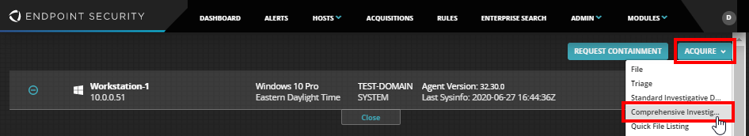

Once the Comprehensive Investigative Details package has been acquired, you can review it in FireEye Endpoint Security's built-in Audit Viewer by clicking "PROCESS DATA ACQUISITION", or you can download it by clicking "Download Full Triage" which we'll do for use with GoAuditParser.

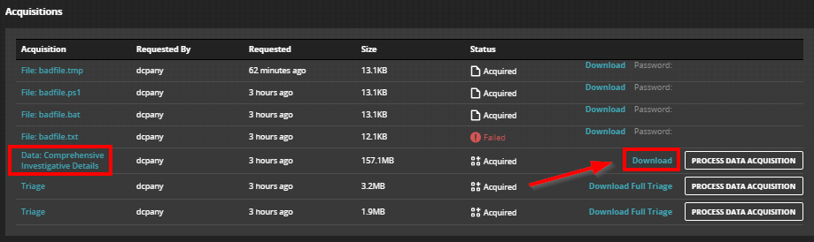

Notice the package comes in a `.MANS` format. This is the format we use for FireEye archives, but it can be opened with any ZIP extraction utility. If you have Redline installed, you'll see the red Redline icon for MANS files. Let's take a look at the contents of this file below.

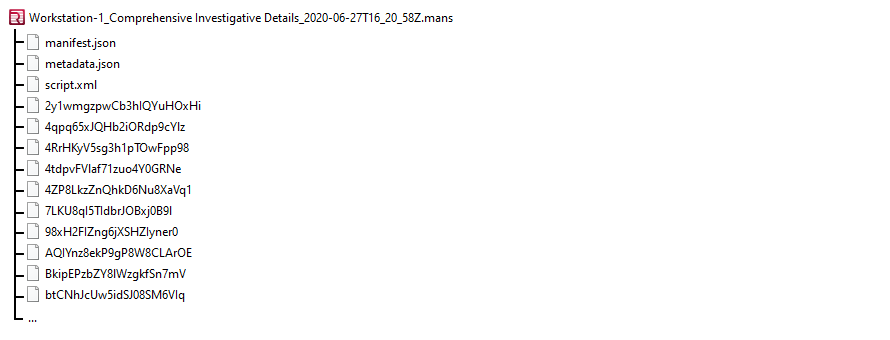

This looks to be quite the obfuscated format, but GoAuditParser knows exactly how to handle these types of files. Let's place the MANS file (not extracted) within its own directory named `zip` and perform a basic parse with GoAuditParser on it specifying the output directory `csv`.

```
goauditparser -i zip -o csv
```
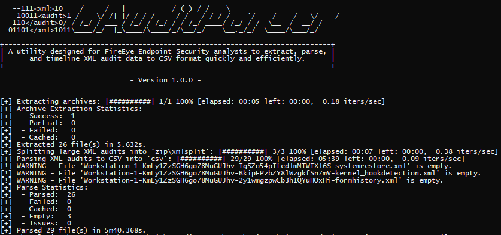

GoAuditParser extracted the files from the `.MANS` file to the input directory and renamed them based on the contents of the `manifest.json` and `metadata.json` files. Next, for any files were larger than 300 MB, GoAuditParser split them into 300 MB chunks in `zip/xmlsplit/`. Finally, GoAuditParser parsed the XML audit files and wrote them into the provided CSV output directory.

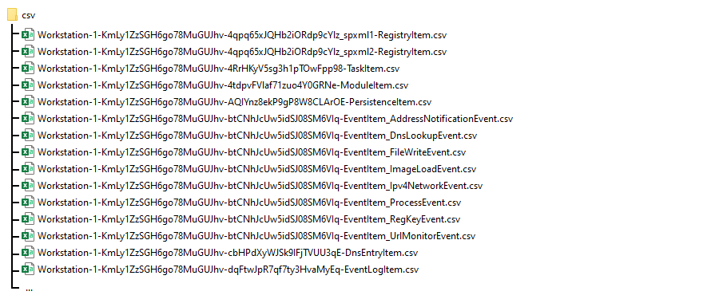

Shown below is one of the output CSV files after being formatted using tips mentioned in the [Working With Excel](#working-with-excel) section.

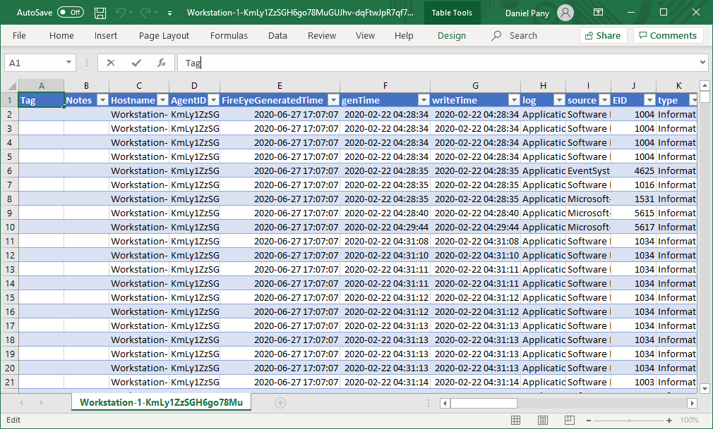

Now we are ready to begin analysis with Excel or perform post-processing / enrichment!

- [Back to top of "Example Usage" Section](#example-usage)

### FireEye Endpoint Security File Acquisitions
[FireEye Endpoint Security](https://www.fireeye.com/solutions/hx-endpoint-security-products.html) is our Enterprise Detection and Response (EDR) solution. From our solution we can request any file on disk. You can acquire a file from any endpoint's "Hosts" page by clicking "ACQUIRE" > "FILE".

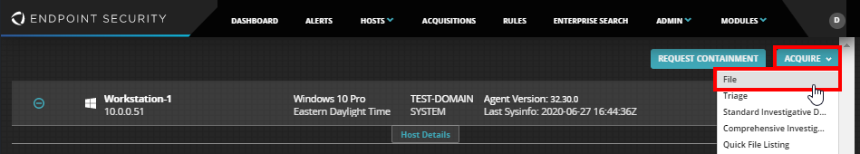

Once you requested files have been acquired, you can download them by clicking "Download". Also, take note of the password we'll need to unarchive it later. (The passwords have been removed from these images)

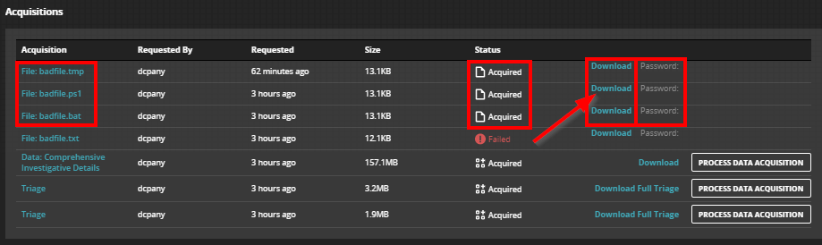

Shown below is the contents of one of these files.

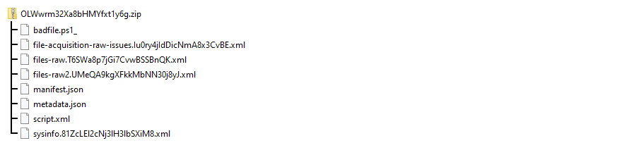

Each of the downloaded archives is encrypted and it would be tedious to extract them all one at a time.

Let's extract all of these files at once. First, place them in a directory named `zip`. Next, run the following command with the flags `-eo <output_dir>` to specify an output directory (optional, default output directory is "files" if `-efo` is used), `-efo` to specify that we only want to extract acquired files, and `-ep <password>` to provide the password for extracting the encrypted archives.
```
goauditparser -i zip -efo -ep <password>
```
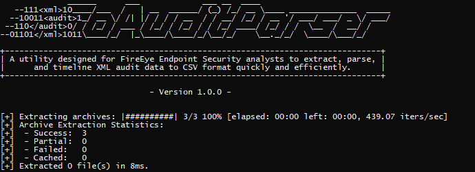

Shown below is the output directory from the command above.


Great! We have our files extracted, but maybe we would prefer a different filename format. GoAuditParser provides you the following options with the `-eff <int>` flag.
```
-eff <int>   Extract File Acquisition Format   Change how filenames for acquired files are formatted.
                                                   1: <hostname>-<agentid>-<payloadid>-<fullfilepath>_  (default)
                                                   2: <hostname>-<agentid>-<payloadid>-<fullfilepath>
                                                   3: <fullfilepath>_
                                                   4: <fullfilepath>
                                                   5: <basefilename>_
                                                   6: <basefilename>
```

Let's use the following command just to get the acquired files extracted with just the base filenames and an underscore `_` at the end to prevent self-pwnage.

```
goauditparser -i zip -eo files2 -efo -ep <password> -eff 5
```

Shown below is the output directory from the command above.


Now we can analyze these files much quicker than if we had manually extracted and renamed them!

- [Back to top of "Example Usage" Section](#example-usage)

### Redline Collection

[Redline](https://www.fireeye.com/services/freeware/redline.html) is a publicly available forensically-sound precursor to FireEye Endpoint Security which lets you collect audit data from a system. Redline lets you create a Collector for Windows, Mac, or Linux. You can copy the Collector to the system you want to perform analysis on and execute it to collect audit data. After it finishes, it places the collected audit data within `./Sessions/AnalysisSession1/Audits/` as shown below.

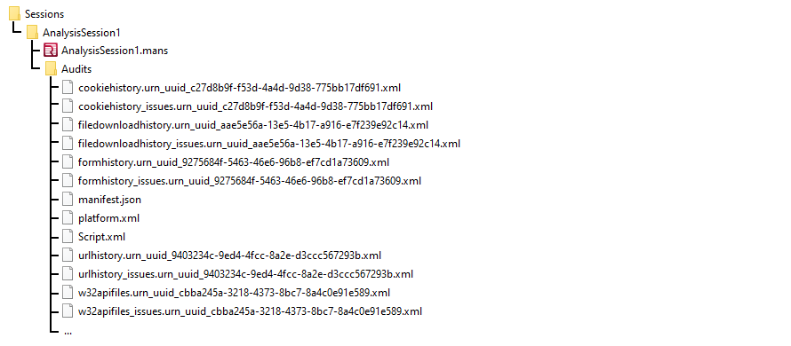

You can use Redline itself to review the collected audits, but you may prefer to use Excel or perform post-processes / enrichment on the collected data. GoAuditParser helps you achieve any of these goals.

Let's perform a basic parse with the following command. (a more useful command is shown later)
```
goauditparser -i Sessions/AnalysisSession1/Audits -o csv
```
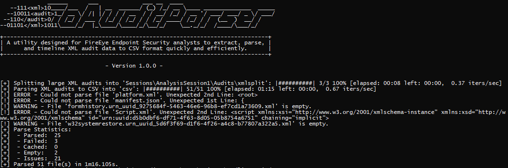

Notice in the console output that the files `platform.xml`, `manifest.json` and `Script.xml` could not be parsed. These files only contain metadata and can be ignored. Also, a file `formhistory.urn...` was found to be empty. This means that while XML file did contain a valid schema, it did not contain any records.

The output directory `csv` is shown below.

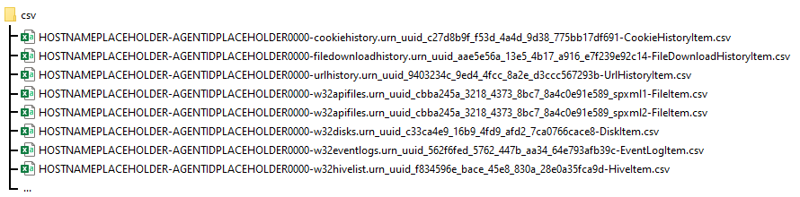

This XML data doesn't match the standardized Mandiant format of `<Hostname>-<AgentID>-<ExtraData>-<AuditType>.xml` which is usually the only place that holds the hostname of the system (unless you happen to have a SystemInfoItem audit). Since default Redline XML filenames don't match that format, GoAuditParser will put the original filename into the `<ExtraData>` field of the output filename and use placeholders for `<Hostname>` and `<AgentID>`. For those unaware, FireEye uses a 22-character AgentID as a unique identifier for that host. The `<AuditType>` for output CSV files is determined by looking inside of the corresponding XML document.

We can provide our own `<Hostname>` with the `-pah <str>` flag and our own `<AgentID>` with `-paa <str>`. 

Let's see how that would work. We'll set the AgentID to "0" since we won't be using it for our purposes. We'll also tag on the `-wo` flag to wipe the output directory of our original files.
```
goauditparser -i Sessions/AnalysisSession1/Audits -o csv -pah OriginalHostname -paa 0 -wo
```
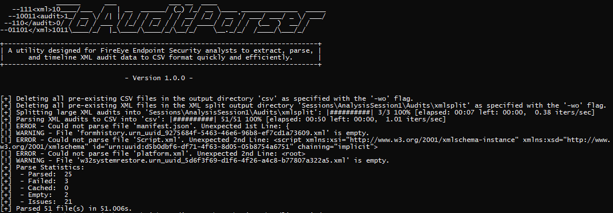

The newly updated output directory `./csv` is shown below.


With that change, the output CSV files look much nicer and shorter. Also, because we provided the hostname, the output CSV files will also contain it.

Shown below is one of the output CSV files after being formatted using tips mentioned in the [Working With Excel](#working-with-excel) section.

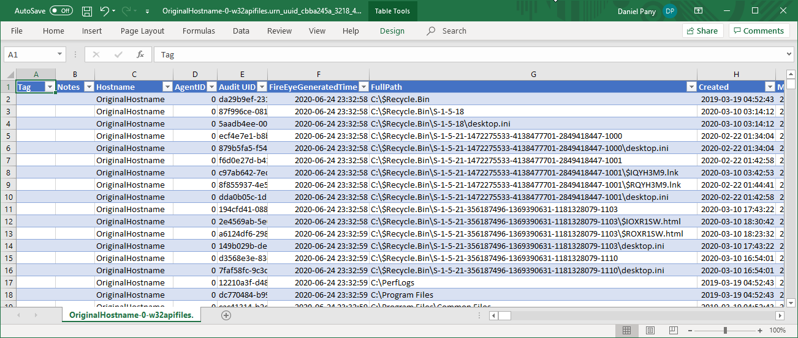

Now we are ready to begin analysis with Excel or perform post-processing / enrichment!

- [Back to top of "Example Usage" Section](#example-usage)

### Working With Excel

While FireEye offers audit-viewing solutions like FireEye Endpoint Security's built-in Audit Viewer and Redline, sometimes you need to work with the data in ways that those offerings weren't designed to support. With Excel, you can use formulas to compute statistics and manipulate the data into the formats you may otherwise need. There are a couple of tricks to getting Excel to work well with audit data, so we're going to try to cover most of those here.

1. [Creating a Table](#creating-a-table)
2. [Fixing Timestamps](#fixing-timestamps)
3. [Fixing Large Row Sizes](#fixing-large-row-sizes)

- [Back to top of "Example Usage" Section](#example-usage)

#### Creating a Table

Let's use an EventLogItem audit as an example. Upon opening it with Excel, here's what you might be presented with.

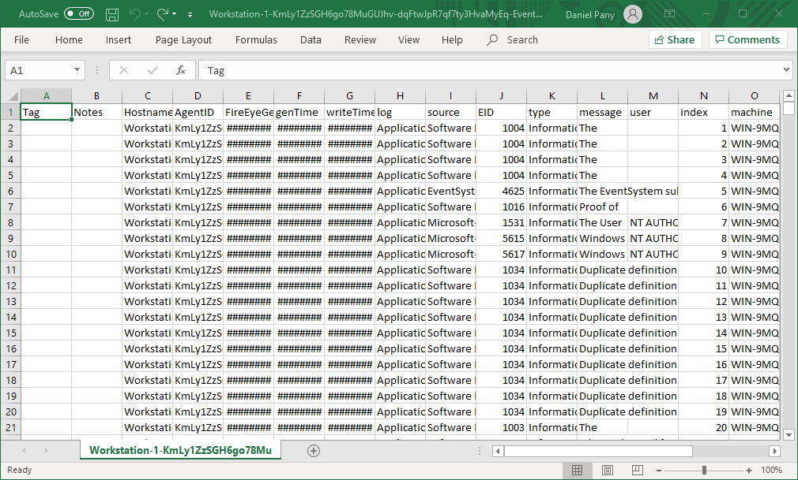

First thing you may want to do is create a table for your data. This sets you up with the ability to filter and sort columns, and makes the row alternate between two different colors, allowing you to more easily trace data along a row. To easily create a table:
1. Make sure you have the cell A:1 selected
2. Hold CTRL and press "a" - this selects all of the present data
  - Don't press CTRL + A twice, or you'll select the entire worksheet!
3. Hold CTRL and press "t" - this prompts you to create a table of the data you have selected
4. Press ENTER

If done properly, it should look something like this.

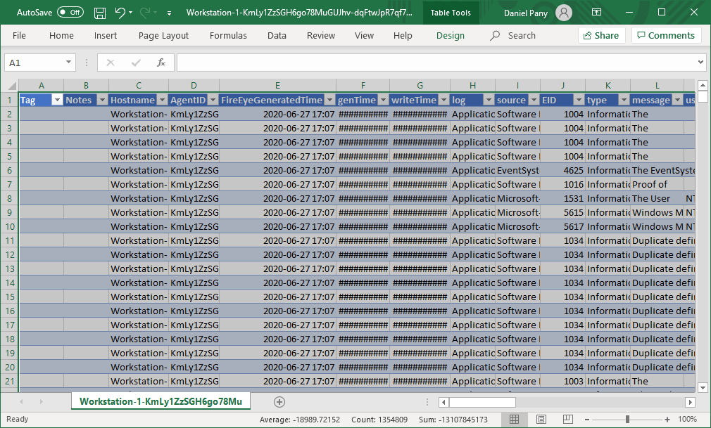

- [Back to top of "Working with Excel" Section](#working-with-excel)

#### Fixing Timestamps

Next, we can see there are some problems with the timestamps where they aren't in the a useful format like `yyyy-mm-dd hh:mm:ss`. Maybe they look like `##########` which is caused by Excel trying to display a value but not having the column space to do so. That can be fixed by changing the column size, but unfortunately the` yyyy-mm-dd hh:mm:ss` timestamp format isn't included as the default format in Excel, so we have to fix it ourselves.

1. Holding CTRL, left click on the column letters (Ex: A, B, C) above the headers for each column holding timestamp values
2. Right click on one of the column letters and select "Format Cells..."

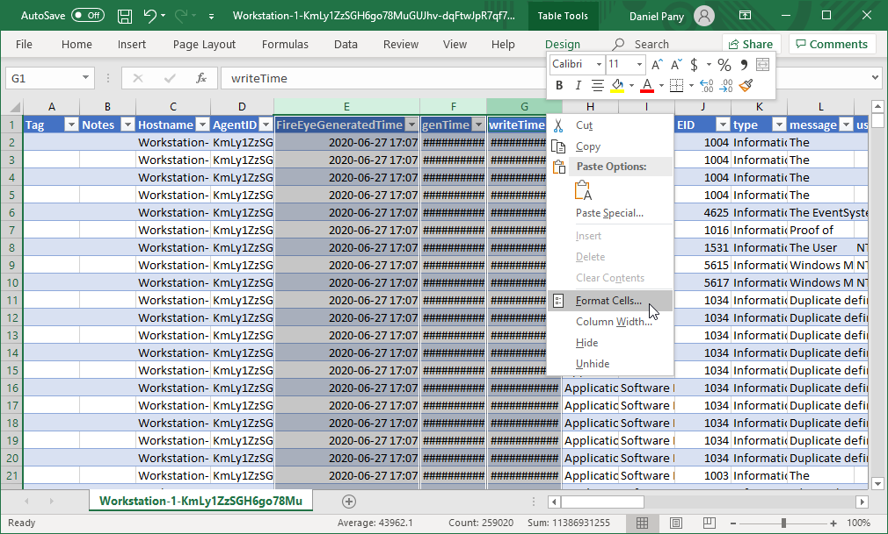

3. Click the "Custom" Category
4. Within the "Type" field, manually put `yyyy-mm-dd hh:mm:ss`
5. Click "OK"

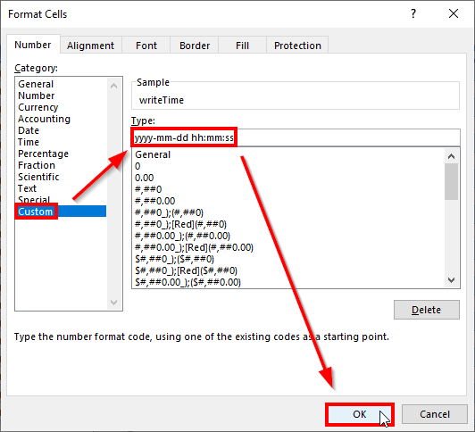

6. Double click the right-most-edge of any of the selected columns

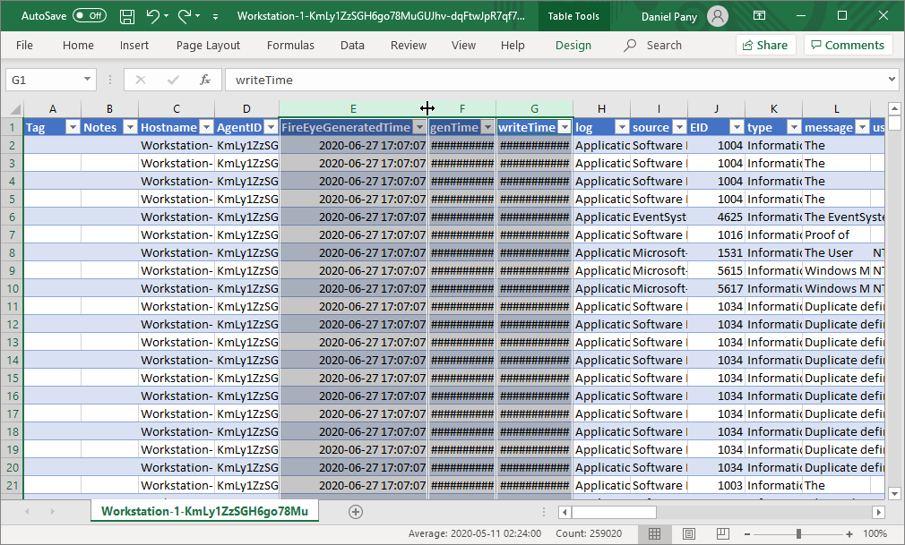

Finally, you should have columns with proper `yyyy-mm-dd hh:mm:ss` formatted timestamps.

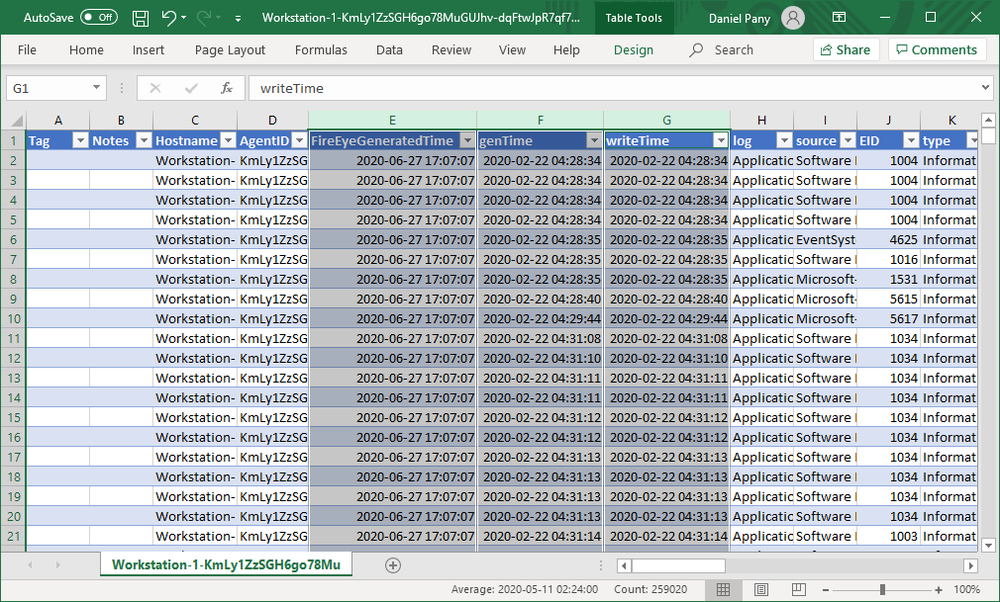

- [Back to top of "Working with Excel" Section](#working-with-excel)

#### Fixing Large Row Sizes

Sometimes, you may find a cell with multiple lines of data in it.

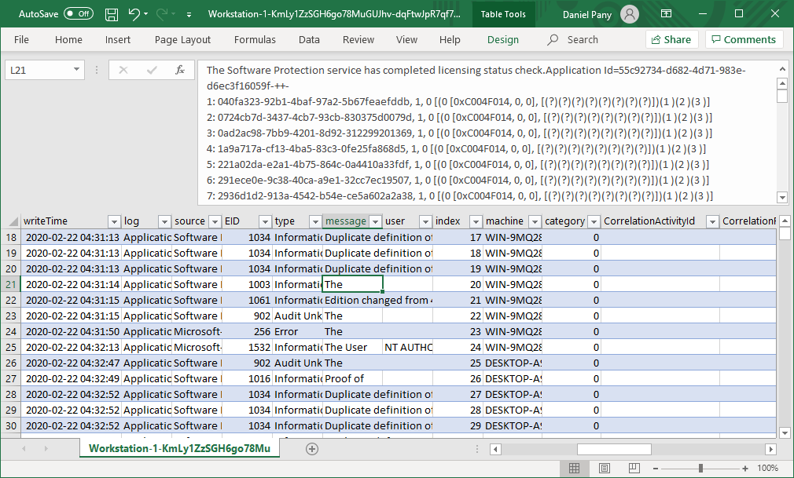

If you click in the value and then click out of it, you may cause the whole row to grow to an unusable height.

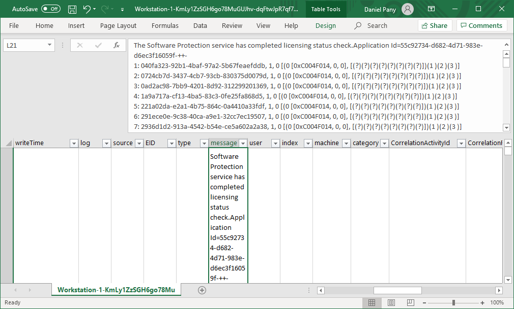

Here's how you can prevent this and fix any rows that have been impacted by this.

1. Hold CTRL and press "a" - this selects all of the present data
2. Press, *but do not hold*, ALT
3. Press, *but do not hold*, "h", then "o", and then "h" - this presents a "Row Height" menu

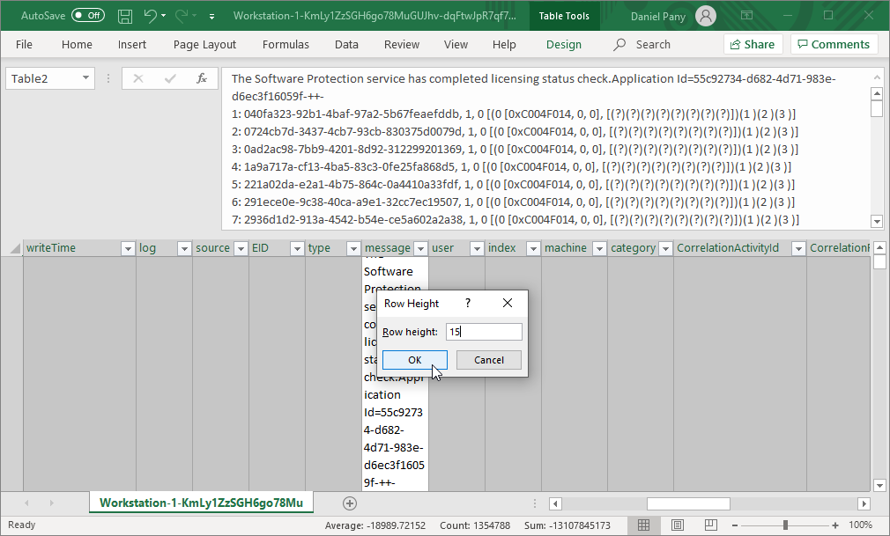

4. Type `15`
5. Press ENTER or click OK

Now all of your rows are fixed back to a normal height!


- [Back to top of "Working with Excel" Section](#working-with-excel)


### Timelines

As long as your XML audit data can be parsed to CSV format, it can be timelined. You may want to review the [Timeline Configuration](#timeline-configuration) file for customizing timeline headers and features.

1. [Parse and Create a Timeline](#parse-and-create-a-timeline)
2. [Create a Timeline After Already Parsed](#create-a-timeline-after-already-parsed)
3. [Timeline Filter](#timeline-filter)

- [Back to top of "Example Usage" Section](#example-usage)

#### Parse and Create a Timeline

For this example, let's assume we have [a MANS file from FireEye Endpoint Security](#fireeye-endpoint-security-comprehensive-investigative-details) and have not already extracted or parsed it to CSV. Let's put the MANS file in a directory named "zip" and run the following command, using `-tl` to timeline the files after they are parsed to CSV. By default, the timeline is written to `<OutputDirectory>/_Timeline_<yyyy-mm-dd>_<hhmm>.csv>`, but you can provide an output filepath for the timeline with `-tlout <filepath>`.
```
goauditparser -i zip -o csv -tl
```
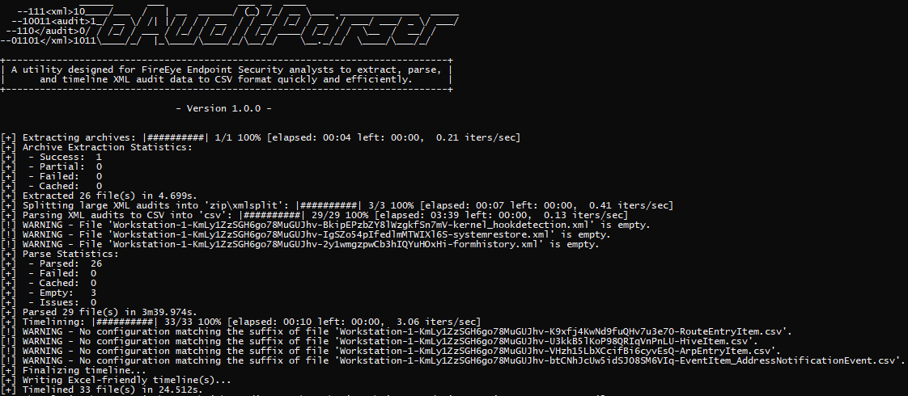

The output directory `csv` is shown below.

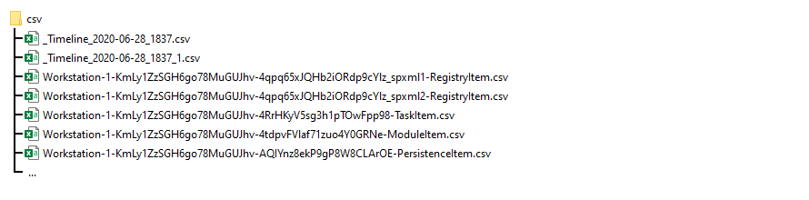

Shown below is the output timeline file after being formatted using tips mentioned in the [Working With Excel](#working-with-excel) section.

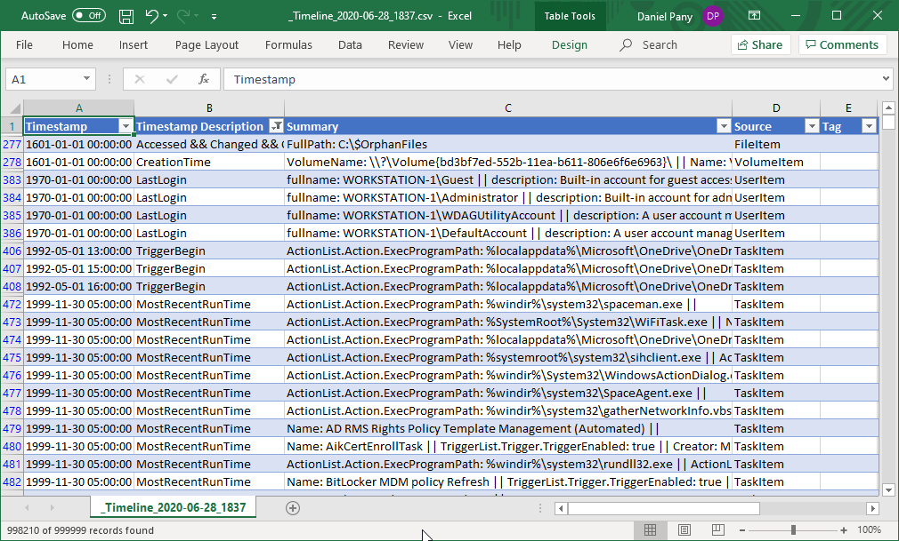

- [Back to top of "Timelines" Section](#timelines)

#### Create a Timeline After Already Parsed

Sometimes you may want to generate a timeline after you have already parsed files. You can make GoAuditParser generate a timeline without parsing any files with `-tlo` and providing the output directory of CSV files with `-o <csv_dir>`.
```
goauditparser -o csv -tlo
```

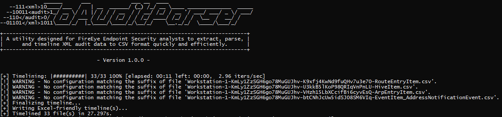

The output directory `csv` is shown below.


Shown below is the output timeline file after being formatted using tips mentioned in the [Working With Excel](#working-with-excel) section.


- [Back to top of "Timelines" Section](#timelines)

#### Timeline Filter

Maybe you're finding that your timeline file is too large or that you only need to focus on a specific timeframe. You can specify a timeline filter with `-tlf <time_filter>`.

```
-tlf <str>   Timeline Filter    Include only events which match the provided filter(s).
                                    Time Filter formats:
                                        "YYYY-MM-DD HH:MM:SS - YYYY-MM-DD HH:MM:SS"
                                        "YYYY-MM-DD HH:MM:SS +-5m"
                                        "YYYY-MM-DD - YYYY-MM-DD"
                                        "YYYY-MM-DD +-5m"
```

Let's make a timeline from CSV files that have already been parsed only containing events five minutes around the timeframe `2020-06-27 16:00:00` with the timeline filter `-tlf "2020-06-27 16:00:00 +-5m"`

```
goauditparser -o csv -tlo -tlf "2020-06-27 16:00:00 +-5m"
```

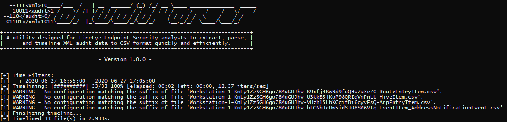

The output directory `csv` is shown below.

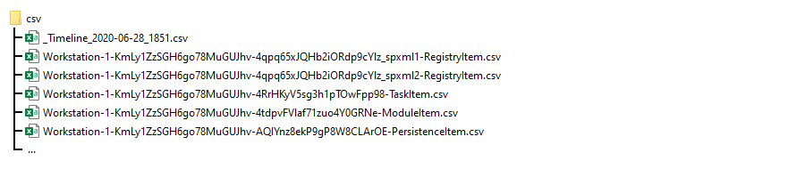

The output timeline file is shown below.

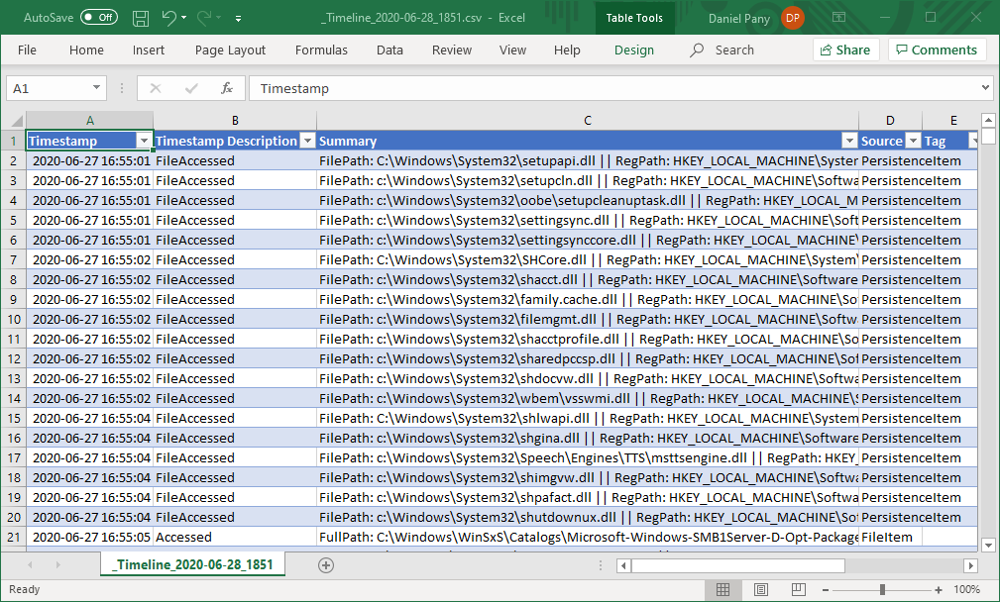

- [Back to top of "Timelines" Section](#timelines)

## Configuration Files

GoAuditParser uses three (3) different configuration files.

1. [Main Configuration](#main-configuration)
2. [Timeline Configuration](#timeline-configuration)
3. [Parse Cache](#parse-cache)

- [Back to "Table of Contents"](#table-of-contents)

### Main Configuration

This configuration file is used for parsing XML audit files to CSV output files. GoAuditParser writes the default main configuration file to `~/.MandiantTools/GoAuditParser/config.json`. You can provide your own main configuration file with `-c path/to/config.json`. If you need a fresh copy of this configuration file, delete the default file and have GoAuditParser attempt to parse XML audit files.

|**Key Name**|**Default Value**|**Explanation**|
|------------|-----------------|---------------|
|`Version`|*variable*|The current version of GoAuditParser. If this value is different from the current version of GoAuditParser, the configuration file is updated.|
|`Dont_Overwrite_With_New_Update`|false|If set to true, GoAuditParser will not update this configuration file if it is outdated.|
|`Automatically_Split_Big_XML`|true|If set to true, GoAuditParser will split XML files into 300 MB chunks for better memory efficiency.|
|`Automatically_Extract_Archives`|true|If set to true, GoAuditParser will automatically extract any FireEye archives to the input directory.|
|`Omit_Nonordered_Headers`|false|If set to true, GoAuditParser will omit any columns whose headers are not specified within `Audit_Header_Configs.#.Header_Order`.|
|`Mandatory_Headers`|"Tag",<br>"Notes",<br>"Hostname",<br>"AgentID"|These specified column headers always come first in CSV output and exist even if these fields aren't present in the audit data.|
|`Optional_Headers`|"Audit UID",<br>"UID",<br>"Sequence Number",<br>"FireEyeGeneratedTime",<br>"EventBufferType"|These specified column headers come after the `Mandatory_Headers` headers in CSV output but don't exist if these fields aren't present in the audit data.|
|`Audit_Header_Configs`|*variable*|Subconfigurations for each audit type. If an audit type isn't present, its data will be parsed automatically.|
|`Audit_Header_Configs.#.Name`|*variable*|The name of the audit type. This field is only metadata and doesn't affect parsing.|
|`Audit_Header_Configs.#.Item_Name`|*variable*|The audit type identifier found within the XML file. If this audit type is found, this subconfiguration is applied. Example: "FileItem"|
|`Audit_Header_Configs.#.Header_Order`|*variable*|These specified column headers come after `Optional_Headers` in CSV output and exist even if these fields aren't present in the audit data. Any non-specified column headers identified by GoAuditParser will be provided after these headers if `Omit_Nonordered_Headers` is set to false and that header is not specified in `Audit_Header_Configs.#.Headers_Omitted`.|
|`Audit_Header_Configs.#.Headers_Omitted`|*variable*|These specified column headers are removed from CSV output.|

- [Back to top of "Configuration Files" Section](#configuration-files)

### Timeline Configuration

This configuration file is used for timelining CSV files. GoAuditParser writes the default timeline configuration file to `~/.MandiantTools/GoAuditParser/timeline.json`. You can provide your own timeline configuration file with `-tlcf path/to/timeline.json`. If you need a fresh copy of this configuration file, delete the default file and have GoAuditParser attempt to timeline audit CSV files.

|**Key Name**|**Default Value**|**Explanation**|
|------------|-----------------|---------------|
|`Version`|*variable*|The current version of GoAuditParser. If this value is different from the current version of GoAuditParser, the configuration file is updated.|
|`Dont_Overwrite_With_New_Update`|false|If set to true, GoAuditParser will not update this configuration file if it is outdated.|
|`Include_Summary_Headers`|true|If set to true, values within the "Summary" column will have headers prepended to the values like `FullFilePath: C:\Windows\Temp\bad.ps1` instead of just `C:\Windows\Temp\bad.ps1` alone.|
|`Unique_Row_Per_Timestamp`|false|If set to true, audit entries with multiple timestamp values that are the same will each be put on separate lines instead of all being put into the same timeline row.|
|`Include_Timestampless_Audits`|true|If set to true, audit entries without a timestamp will be included in the timeline instead of being omitted.|
|`Extra_Fields_Order`|"Hostname",<br>"AgentID",<br>"MD5",<br>"Size",<br>"User",<br>"SignatureExists",<br>"SignatureVerified",<br>"SubAuditType",<br>"Extra1",<br>"Extra2",<br>"Extra3",<br>"Tag",<br>"Notes"|The first columns in a timeline will always be "Timestamp", "Timestamp Description", "Summary", and "Source". Anything else you want to include in the timeline as its own column can be specified here. To fill one of these columns, you'll need to specify which columns apply for each audit type in `Audit_Timeline_Configs.#.Extra_Fields`.|
|`Audit_Timeline_Configs`|*variable*|Subconfigurations for each audit type. If an audit type isn't present, GoAuditParser will inform you at runtime and ignore it.|
|`Audit_Timeline_Configs.#.Name`|*variable*|The name of the audit type. This field is only metadata and doesn't affect timelining.|
|`Audit_Timeline_Configs.#.Filename_Suffix`|*variable*|The audit type identifier found within the `<AuditType>` portion of the CSV filename. If this audit type is found, this subconfiguration is applied. Example: "FileItem"|
|`Audit_Timeline_Configs.#.Timestamp_Fields`|*variable*|These specified column headers are what GoAuditParser will look for when creating timeline rows. The timestamp value will fill the cell for the "Timestamp" column and the header for this value will fill the cell for the "Timestamp Description". If `Unique_Row_Per_Timestamp` is set to false, similar timestamps entries per audit row will be merged.|
|`Audit_Timeline_Configs.#.Summary_Fields`|*variable*|These specified column headers will fill out the "Summary" column of the timeline. If `Include_Summary_Headers` is set to true, the headers will be prepended to each value.|
|`Audit_Timeline_Configs.#.Extra_Fields`|*variable*|These specified column headers will fill out the fields specified in the `Extra_Fields_Order` column of the timeline. If you want to have a specific header fill out a field of a different name, you can use the syntax `"auditheader>extrafield"`. Example: `"DataLength>Size"`|

- [Back to top of "Configuration Files" Section](#configuration-files)

### Parse Cache

This cache file is used for keeping track of which files have been parsed. GoAuditParser writes the parse chache file to `<InputPath>/_GAPParseCache.json`.

|**Key Name**|**Default Value**|**Explanation**|
|------------|-----------------|---------------|
|`Version`|*variable*|The current version of GoAuditParser. If this value is different from the current version of GoAuditParser, the configuration file is updated.|
|`OutputDirectories`|*variable*|Subcaches for each output directory specified. Breaking up the output cache by output directory allows you to parse files to different directories without worry of cache conflicts.|
|`OutputDirectories.#.OutputDirectory`|*variable*|The absolute path of the output directory specified.|
|`OutputDirectories.#.XMLFiles`|*variable*|Subcaches for each XML audit file identified.|
|`OutputDirectories.#.XMLFiles.#.Name`|*variable*|The filename of the XML audit file.|
|`OutputDirectories.#.XMLFiles.#.Size`|*variable*|The file size of the XML audit file.|
|`OutputDirectories.#.XMLFiles.#.Status`|*variable*|The status of the XML audit file. Can be "parsed", "ignored/issues", "ignored/empty" "failed/rename", "failed/error", "failed/notexist", or "split".|
|`OutputDirectories.#.ArchiveFiles`|*variable*|Subcaches for each archive file (ZIP/MANS) file identified.|
|`OutputDirectories.#.ArchiveFiles.#.Name`|*variable*|The filename of the archive file.|
|`OutputDirectories.#.ArchiveFiles.#.Size`|*variable*|The file size of the archive file.|
|`OutputDirectories.#.ArchiveFiles.#.Status`|*variable*|The status of the XML audit file. Can be "extracted", "partial", or "failed".|

- [Back to top of "Configuration Files" Section](#configuration-files)

## All Version Changes

**v1.0.0 - February 25, 2021**
* Initial public release of GoAuditParser!

## FAQ & Support

**What is the AgentID field?**
- FireEye uses a 22-character AgentID as a unique identifier for a system. This is used in FireEye Endpoint Security but is not used in Redline.

**What is the Audit UID field?**
- Each record within the XML audit contains a unique identifier generated at the time the data was collected. It is a metadata field only, and does not represent the collected data in any other way.

**What is the FireEyeGeneratedTime timestamp?**
- This timestamp is when the FireEye tool collected that record of information. It is a metadata field only, and does not represent the collected data in any other way.

**Why are my timestamps appearing malformed in Excel?**
- Good old Excel. Rest assured, your timestamps are likely fine. You need to tell Excel what format the timestamps should be in (`yyyy-mm-dd hh:mm:ss`) and make sure the column is wide enough to display the value. Check out the [Working With Excel](#working-with-excel) section for more details.

**Why does it say my XML audit file is empty when there is clearly a little data in there?**
- GoAuditParser reports when an XML audit file as "empty" if the XML schema for the audit is present but there are no entries or "rows" that can be parsed out of the file. If there is no XML schema present, it reports the file as "failed".

**Where are the CSV versions of my "Issues" files?**
- GoAuditParser does not parse Issues files, but it will tell you how many it identified in the Parse Statistics Summary.

**What are these ".csv.incomplete" files in my output directory?**
- When GoAuditParser starts parsing an XML file, it attempts to create a temporary `.csv.incomplete` file in the output directory. If it cannot create this file, it skips processing the XML file. This is done to prevent wasted time parsing any particularly large XML file only to not be able to write the CSV output to disk. After it successfully writes the output contents to the temporary file, GoAuditParser makes an operating system call to rename the temporary `.csv.incomplete` file to the finalized `.csv` file. The whole point of the temporary `.csv.incomplete` file is in case you already have the finalized `.csv` file from a previous GoAuditParser parse open in Excel and you go to reparse the same XML files again. Excel locks each open CSV file with a handle, preventing GoAuditParser from overwriting it. If you receive a "could not rename temp file to finalized file" error message, you can be rest assured the finalized data is at least in the `.csv.incomplete` file and work with that file instead of needing to reparse everything over again.

**Can I change the order of columns or omit unwanted columns from my CSV output?**
- You can do both! Locate your main configuration file and set your preferred column orders with the `Mandatory_Headers`, `Optional_Headers`, and `Audit_Header_Configs.#.Header_Order` fields. If you want to omit specific columns from specific audits, set the `Audit_Header_Configs.#.Headers_Omitted` field. If you want to omit all unspecified audit columns, set `Omit_Nonordered_Headers` to true. Check out the [Main Configuration](#main-configuration) section for more details.

**Why do my Hostname and AgentID fields have placeholders?**
- This occurs when the input XML audit filename does not match the expected Mandiant standardized naming format of `<Hostname>-<AgentID>-<ExtraData>-<AuditType>`. This is the primary location that GoAuditParser uses to identify the Hostname and AgentID. If the input XML audit filenames do not match this format, the original XML audit filename is put into the `<ExtraData>` field in the output CSV filename and the Hostname and the AgentID fields are replaced in the output CSV files with placeholders `HOSTNAMEPLACEHOLDER` and `AGENTIDPLACEHOLDER0000` with those extra four (4) '0' characters padding the AgentID to the expected 22-character length. To overwrite these placeholders, use the flags `-pah <ReplacementHostname>` and `-paa <ReplacementAgentID>`.

**Why do my filenames contain `\_spxml#` or `\_spcsv#`?**
- The `_spxml#` filename fragment contains the sequence number of an XML audit file that has been split at the XML level into multiple files. By default, GoAuditParser splits files that are larger than 300MB into `<input_dir>/xmlsplit` and then parses those files instead of the original. The `_spcsv#` filename fragment contains the sequence number of the output CSV that has been split into multiple files. By default, GoAuditParser splits CSV files by one (1) million rows as a compatibility feature for Excel. You can disable automatic XML splitting in the main configuration file by setting `Automatically_Split_Big_XML` to false and you can disable the one (1) million row split by providing the `-raw` flag.

**Why does GoAuditParser split my data into chunks?**
- GoAuditParser performs two (2) types of splitting, XML splitting and CSV splitting. By default, GoAuditParser splits XML files that are larger than 300MB into `<input_dir>/xmlsplit` and then parses those files instead of the original. This is because GoAuditParser uses multiple threads (Goroutines) and hashmaps to store parsed XML data before converting it to CSV for a number of efficiency and speed reasons, but threads and hashmaps are very memory expensive. Splitting the XML files before parsing them is the best solution to excessive memory consumption without sacrificing too much speed. Also, by default, GoAuditParser splits output CSV files by one (1) million rows as a compatibility feature for Excel. You can disable automatic XML splitting in the main configuration file by setting `Automatically_Split_Big_XML` to false and you can disable the one (1) million row split by providing the `-raw` flag.

**I got an "out of memory" error!**
- This issue is mostly fixed thanks to file splitting and buffered file reading for larger files, but it may still happen. This issue likely occurs when multiple large files are attempting to be parsed at the same time on two or more threads (Goroutines). Try forcing GoAuditParser to use only one thread with `-t 1`.

**GoAuditParser is making my computer slow!**
- GoAuditParser automatically uses the same number of threads (Goroutines) as the number of CPUs your computer has to be as speedy as possible. Try forcing GoAuditParser to use fewer threads or only one thread with `-t 1`, but this will slow down your parsing speed.

For questions, bugs, suggestions, or any other feedback, please contact GoAuditParser's primary developer Daniel Pany at daniel.pany@mandiant.com.

- [Back to "Table of Contents"](#table-of-contents)